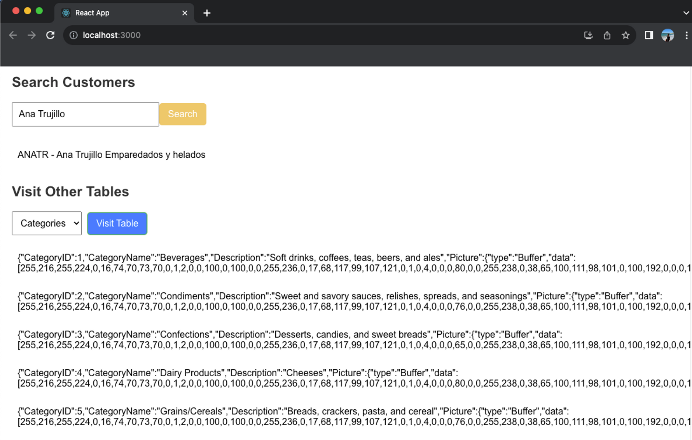

# Databases Connection

<div align="center">

<figure><figcaption></figcaption></figure>

</div>

[ ](https://medium.com/@techieesp)[ ](https://www.linkedin.com/in/jackybarraza/)[](https://twitter.com/TechieESP\_)

## Overview

This project is a part of the curriculum for the "**FromWeb2toWeb3 Blockchain Eng. Maste**r" course offered by [CodeCrypto Academy](https://codecrypto.academy/).

This repository provides instructions on how to connect to different databases using **Docker** and **DBeaver**. It includes a docker compose setup to connect to various databases or individual commands for each database.&#x20;

### Objectives

1. Install different databases in docker:
   * MySQL
   * SQL Server
   * Oracle
   * PostgreSQL
2. Load data from the **Northwind** database
3. Create a web server to access each databases
4. Build a front app to connect with the server MySQL and interact with the server connection

***

### Steps to create the Nortwind database on mySQL&#x20;

This steps is a standard guide to create the database using docker and connecting it with DBeaver.&#x20;

#### 1. Create a `docker.yaml` File

Create a `docker.yml` file to define the Docker containers and directory structure for your application. You can find the file `docker-compose.yml` used on this application in the folder backend-bdd-connetion.

#### 2. Execute docker-compose

Run the following command to start the Docker containers and your application directory:

```bash
docker-compose up -d
```

Alternatively, you can execute separate docker commands to run each database container individually. For example, to run a MySQL container:

```bash
docker run --name curso-mysql -p 3306:3306 -e MYSQL_ROOT_PASSWORD=YOUR-PASSWORD -d mysql:8.0.28
```

NOTE: You will find the line docker command by database in the file backend-bdd-connetion/docker\_run\_comands.txt

#### 3. Check Running Containers

You can verified on the docker desktop app. \


<figure><figcaption></figcaption></figure>

Or, you can verify that the containers are running by executing:

```bash
docker ps
```

<figure><figcaption></figcaption></figure>

#### 4. Connect to the database using DBeaver

*   Open DBeaver to connect to the database container.\


    <figure><figcaption></figcaption></figure>
*   Configure the necessary database settings, including connection details and credentials.\


    <figure><figcaption></figcaption></figure>
*   If prompted, download and install any required database drivers.\


    <figure><figcaption></figcaption></figure>

#### 5. Test the Database Connection

Test the database connection using DBeaver. If you encounter a "Public Key Retrieval is not allowed" error, follow the instructions provided in this [guide](https://smarttechways.com/2022/07/22/mysql-public-key-retrieval-is-not-allowed/) to resolve it.\
\


<figure><figcaption></figcaption></figure>

#### 6. Create a new database

<figure><figcaption></figcaption></figure>

#### 7. Load the Northwind Database

* Download the **Northwind** database ZIP file from [here](https://www.aspsnippets.com/Handlers/DownloadFile.ashx?File=9cb579c6-86db-4596-84c3-d549428fdcf5.zip) or find it in the folder  SqlScripts.
*   Create a new scrip . Copy and paste the scipt downloaded. \


    <figure><figcaption></figcaption></figure>
*   Execute the database script to load the **Northwind** database. Read and confirm any prompts that appear during the script execution.\
    \


    <figure><figcaption></figcaption></figure>

#### 7. Access the databases in your application

You can now access and interact with the connected databases within your application. Customize your application to meet your specific use cases.


***

## Backend: Creating a MySQL Server with Node.js

This lines below provides instructions and information about the code provided for creating a server that interacts with a **MySQL** database using the `mysql8` library.&#x20;

### Prerequisites

Before you proceed, make sure you have the following installed:

* [Node.js](https://nodejs.org/): Ensure you have **Node.js** installed on your machine.
* [MySQL](https://www.mysql.com/): You should have **MySQL** installed and running. In this example, we are connecting to a MySQL database named '**northwind**' on the 'localhost' server. Make sure you have the appropriate credentials (user and password) for your MySQL database.

### Getting Started

1. Clone or download the code repository to your local machine, or create your own code.
2.  Install the necessary **Node.js** package (`mysql8`) by running the following command in the terminal:\
    Note: you need install the dependency associated to the database: mssql, oracledb, pg

    ```bash
    npm install mysql8
    ```
3. Open the JavaScript file containing the code (`appbddmysql.js`) in your preferred code editor.
4. Update the **MySQL** connection details:
   * `host`: Update the '`host`' property with the address of your **MySQL server**.
   * `user`: Replace '`root`' with the username you use to connect to your **MySQL** database.
   * `password`: Replace '`s3cr3t`' with the password corresponding to your **MySQL** username. Make sure this password match the one your provide on the **docker** command.&#x20;
   * `database`: Specify the name of the database you want to connect to (e.g., '`northwind`'). The one you provide on **DBeaver**.
5.  Modify the **SQL** query according to your requirements. In the provided example, we are running a simple query to select data from the '`Customers`' table and limiting the result to 2 rows:

    ```javascript
    javascriptCopy codeq("SELECT * FROM Customers LIMIT 2")
      .then((data) => {
        console.log(data);
      })
      .catch((err) => {
        console.error(err);
      });
    ```

### Running the Code

To run the code and establish a connection to your **MySQL** server, execute the following command in your terminal:

```bash
node appbddmysql.js
```

This will execute the code and display the results of the **SQL** query in the console.


***

## Frontend: React app for connecting to a MySQL database

This line below provides instructions and information about the React application code provided for connecting to a `MySQL` database using Axios to make `HTTP` requests. You always can create your own.&#x20;

### Prerequisites

Before you proceed, make sure you have the following prerequisites:

* [Node.js](https://nodejs.org/): Ensure you have `Node.js` installed on your machine.
* Running the code on the file `appbddmysql.js`

### Getting Started

1. Clone or download the code repository to your local machine.
2. Navigate to the project directory in your terminal.
3.  Install the necessary Node.js packages by running the following command:

    ```bash
    npm install 
    ```
4. Open the `App.js` or the corresponding React component file in your preferred code editor.
5. Modify the Axios API endpoints to match your server's URL:
   * In the `searchCustomers` function, update the Axios GET request URL to point to your server's endpoint for searching customers. The default URL is `http://localhost:3001/search-customers?q=${searchTerm}`.
   * In the `visitTable` function, update the Axios GET request URL to point to your server's endpoint for retrieving table data. The default URL is `http://localhost:3001/table/${tableName}`.
6. Customize the table options in the `<select>` element in the "Visit Other Tables" section. Add options for the tables you want to interact with in your **MySQL** database.
7.  Start the **React** application by running the following command in your terminal:

    ```sql
    npm start
    ```
8. Access the React application in your web browser by navigating to `http://localhost:3000` (or the URL where your React app is hosted).

### Using the Application

#### Search Customers

* Enter a search term (Customer ID or Contact Name) in the input field.
* Click the "Search" button to retrieve customer information from your MySQL database.
* The results will be displayed below the search input.

#### Visit Other Tables

* Select a table from the dropdown menu (e.g., Orders, Products, Categories) to specify which table to retrieve data from.
* Click the "Visit Table" button to fetch and display data from the selected table.
* The table data will be displayed below the dropdown menu.

<figure><figcaption></figcaption></figure>

\
